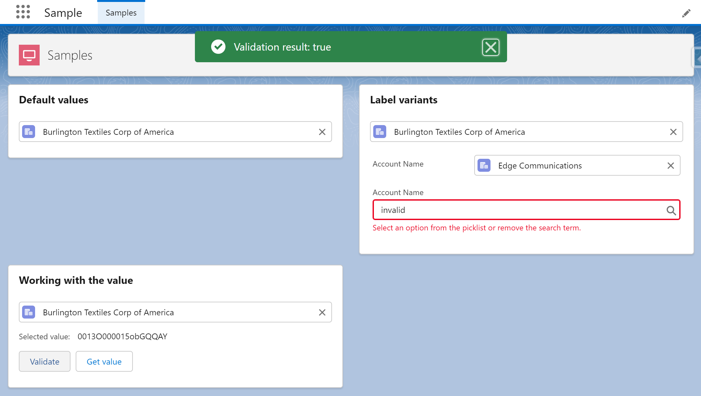

# LWC Lookup Native



## About

Generic LWC lookup component with the native lightning record edit form.

## History

A few months ago, I developed a custom lookup component to be used on a custom datatable ( https://github.com/PipeLaunch/lwc-lookup ). It was a complex component since it required multiple LWC components like a modal to do an extended search, keyboard navigation support, custom labels, apex code to do the queries, etc. So, including this custom component in new projects isn’t ideal.
After I did a proof of concept with the lighting record edit form, I found out that this "hack" works in production, and we can use the native Salesforce component with just a few lines of code to expose the essential properties.

## Features

-   Integrated on a single component (easy to copy to multiple projects)

## Notes

-   On mobile the layout doesn't fill the full width after selected
-   Limited to a single selection

## Instructions

### Use on your project

Everything was developed in a single LWC, so you just need a new single component on your project.

-   Copy the following files to your project:
    -   force-app/main/default/lwc/lwcLookupNative/\*\*
-   Call the component and pass the options

```
<c-lwc-lookup-native></c-lwc-lookup-native>
```

### Testing and learn how to use it

-   Run the `createorg.sh` to create a scratch org
-   Open the `Sample` lightning app
-   Explore the code on the `samples` component
-   Edit the page to preview on mobile devices or login with your mobile device (check the `password.env` file)

## Flow support

There's no need to use this component inside a flow since salesforce provides a native lookup component.
